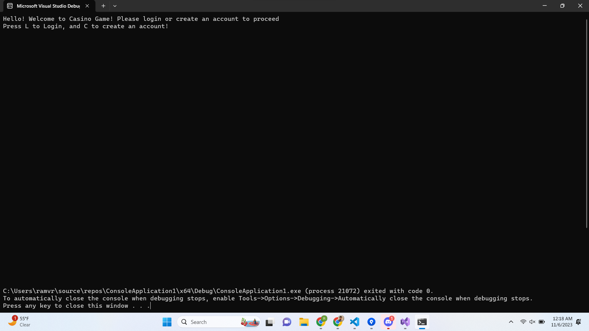

# Casino Game 

## Authors:
[Samyak Kakatur](https://github.com/therealsamyak) | 
[Joshua Pena](https://github.com/jahooba) | 
[Ram Rao](https://github.com/KleeWai) | 
[Arya Thammanna](https://github.com/atham011)

## Project Description

### Why a Casino?
This project involves data collection, data retrieval, and Computer Opponent coding in C++. Normally, this is all done in Python / SQL using databases, instead of the more rudamentry method we are using. However, by limiting ourselves to the basics, we are further demonstrating our knowledge of C++.

Currently, our project features:
* Multiple Casino games (Poker, Craps).

    * All games have a computer opponent.

* Gambling!

    * Users can win / lose money through wagers.
    * Financial and Statistical information is stored to User Profiles so users can restart from where they left off.

* Statistics collected and displayed (both per user, and can be compared globally!):

    * Games played.
    * Money won (or lost) over lifetime of the account
    * Win Rate.
 

This will all be done in C++ and its associated, built-in libraries such as iostream, cmath, ctime, and cstdlib.
 

This project takes in **Keyboard Input** whenever necessary to interact with all the menus and games. A Keyboard is mandatory to gain the full experience.
 

The project can output a variety of different screens **to the terminal**, such as:
* Specific UIs for each of the games.

    * Ex. Your current hand in Poker.

* Menus to go between features of the projects.
* User statistics.

## User Interface Specification

### Navigation Diagram

#### Description
This nagivation diagram shows the different ways in which the user can navigate the program. They can beging by either logging in to an existing account or creating a new log in, which will then promt them to log in using their new account. After that the user will be taken to a home page where they can either check their profile, begin playing poker, or logout. By checking out their profile they can view both thier stats and account balance. If the user chooses to instead play poker, they will be given the option to resume an existing game, or start a new game. While playing, the user will be prompted to take different poker actions until either the game is finished or they choose to puase and exit the game. Both scenerios will take the user back to the home page from which they have the option to logout.

### Screen Layouts

#### Opening Screen

This screen is to get the user initiated with their first time playing, and let's them know to create an account or proceed. It also clearly, very simply states the instructions the user needs to follow to create an account or Login, this is a simple screen without any visual clutter so the user can have a good experience.
 

#### Create Account Screen

This is another simple screen where the user is directed to create their username and password, the user is instructed to create a unique and safe password for account safety, and is reassured that we don't save their password anywhere, and at the end the user knows that their creation was successful.
 

#### Login Screen

This is another simple screen where the user is directed to create their username and password, the user is instructed to create a unique and safe password for account safety, and is reassured that we don't save their password anywhere, and at the end the user knows that their creation was successful.
 

#### Main Menu Screen

This is a very simple menu screen where the user can see that they are logged in correctly, and they are also hyper linked to see the latest updates, this is a standard we want to follow from video games. Then the user is simply instructed on how to proceed next, this also has no visual clutter.
 

#### Profile Screen

This is a very simple profile screen where the user has the choice to go to two separate screens, and is properly instructed how to do them, we have it like this so we can avoid confusion and visual clutter between balance info and their overall stats.
 

#### Statistics Screen

This is a very simple way the user can get information of their lifetime performance in the game for their own fun and enjoyment, and this adds potential for a leaderboard and adds an aspect of competition.
 

#### Balance Screen

This is a very simple way the user can get information of their lifetime performance in the game for their own fun and enjoyment, and this adds potential for a leaderboard and adds an aspect of competition.
 

#### Poker Main Manu Screen

In this screen, the user can clearly select an option of their choice, to either start a new game, to resume their old game (if there is one), or to quit to main menu. The screen clearly instructs the user what key to press to get their desired option, and gets rid of visual clutter.
 

#### Poker Action Screen

On the top of the screen, the user is told that they are in poker action, and they can clearly see their hand  and their current bet in dollars. This way, they already have the most crucial information at their first glance. The rest of the screen serves to let the user know how to pick one of the four actions to do.
 

## Class Diagram

### Poker
This is a typical game of 5-card Draw poker. The class contains a map for win conditions, a vector of all participating players, a Deck to distribute cards out of, and a Hand to keep track of cards drawn. It can also score Hands according to its own algorithm, to see who wins the game.
 
 

### Hand
The hand stores a vector of Cards, and has functionality relating to adding to / dealing from the hand. In addition, the hand can sort itself automatically.

#### Deck
A Deck is a special type of hand, that has all the same functionality, but also automatically generates a 52-card deck, and can distribute a random card from that deck. 

#### Cards
Cards are a struct that hold both a suit, and a value. Both of which can hold values similar to a standard 52-card deck, respectively.
 
 

### Player
Player is an abstract class that all players are based off of. All Players have a name, a Hand to hold cards, and a Balance (money to gamble). 

#### Balance
Balance keeps track of a balance, as well as has the ability to modifiy that balance.

#### Statistics
Statistics keeps track of a file (or creates a file if one isn't available), where all the user statistics are stored / updated. 

#### Poker Player
A Poker Player additionally has statistics that are related to their performance in Poker. They also gain the ability to make poker actions.

#### Poker Computer
A special type of Poker Player that has similar functionality, but makes their moves according to an algorithm instead of user-input. 

#### Poker Action
A Poker Action is a struct that has a field for the type of the action as well as the bet amount. 

#### PokerActionTypes
* Hold
* Bet
* Fold

 > ## Phase III
 > You will need to schedule a check-in for the second scrum meeting with the same reader you had your first scrum meeting with (using Calendly). Your entire team must be present. This meeting will occur on Zoom and should be conducted by Wednesday of week 8.
 
 > BEFORE the meeting you should do the following:
 > * Update your class diagram from Phase II to include any feedback you received from your TA/grader.
 > * Considering the SOLID design principles, reflect back on your class diagram and think about how you can use the SOLID principles to improve your design. You should then update the README.md file by adding the following:
 >   * A new class diagram incorporating your changes after considering the SOLID principles.
 >   * For each update in your class diagram, you must explain in 3-4 sentences:
 >     * What SOLID principle(s) did you apply?
 >     * How did you apply it? i.e. describe the change.
 >     * How did this change help you write better code?
 > * Perform a new sprint plan like you did in Phase II.
 > * You should also make sure that your README file (and Project board) are up-to-date reflecting the current status of your project and the most recent class diagram. Previous versions of the README file should still be visible through your commit history.
 
> During the meeting with your reader you will discuss: 
 > * How effective your last sprint was (each member should talk about what they did)
 > * Any tasks that did not get completed last sprint, and how you took them into consideration for this sprint
 > * Any bugs you've identified and created issues for during the sprint. Do you plan on fixing them in the next sprint or are they lower priority?
 > * What tasks you are planning for this next sprint.

 
 > ## Final deliverable
 > All group members will give a demo to the reader during lab time. ou should schedule your demo on Calendly with the same reader who took your second scrum meeting. The reader will check the demo and the project GitHub repository and ask a few questions to all the team members. 
 > Before the demo, you should do the following:
 > * Complete the sections below (i.e. Screenshots, Installation/Usage, Testing)
 > * Plan one more sprint (that you will not necessarily complete before the end of the quarter). Your In-progress and In-testing columns should be empty (you are not doing more work currently) but your TODO column should have a full sprint plan in it as you have done before. This should include any known bugs (there should be some) or new features you would like to add. These should appear as issues/cards on your Project board.
 > * Make sure your README file and Project board are up-to-date reflecting the current status of your project (e.g. any changes that you have made during the project such as changes to your class diagram). Previous versions should still be visible through your commit history. 
 
 ## Screenshots
 > Screenshots of the input/output after running your application
 ## Installation/Usage
 > Instructions on installing and running your application
 ## Testing
 > How was your project tested/validated? If you used CI, you should have a "build passing" badge in this README.
 
